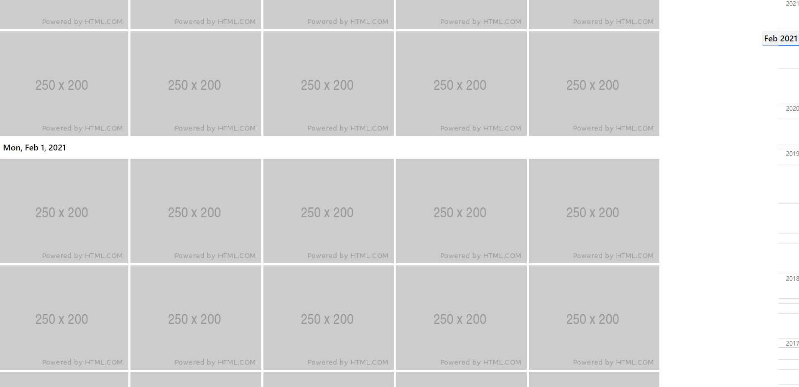

# Timeline Blazor component

It is just an experiment to play with Blazor framework.

Similar to Google Photo timeline. Example:

## Structure

- component: contains timeline component
- example: example client-side blazor application that uses the component

[tailwindcss](https://tailwindcss.com) is used to avoid work with css stuff.

## Investigate

[Intersection Observer API](https://developer.mozilla.org/en-US/docs/Web/API/Intersection_Observer_API)
